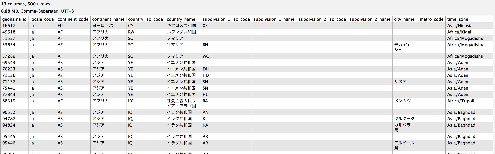
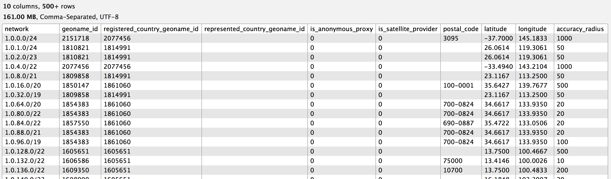
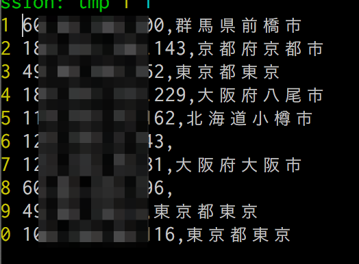

% IPアドレスから地域を求めてみた
% yamotonalds
% 2016-11-28
# 

## 先週金曜の午後…

## 運営の某Tさん

. . .

「大量のIPアドレスから大まかな地域を調べる方法って無いですかね？」

## 

🐼「ちょっと調べてみます^^」

##

🐼（とは言ったものの…）

##


## この時点で🐼が知っていたこと

- IPアドレスから大まかな地域を調べる方法は存在する
    - 原理は知らない
- 正確な住所や個人を特定することはできない
    - プロバイダーに記録はあるはずなので警察なら調べられる 👮

## 調べてわかったこと

分報窓での情報提供、ありがとうございます m(_ _)m

- IPからホスト名を引いたりtracerouteで分かる場合がある
    - OCNの例 p****-ipbfp****osakakita.osaka.ocn.ne.jp.
        - 大阪府大阪北？
    - ぷららの例 i***-***-***-***.s41.a011.ap.plala.or.jp.
        - 「a011」は埼玉県
        - 「s41」はフレッツネクストファミリー
    - [http://wiki.tomocha.net/network_ISP_areasearch.html](http://wiki.tomocha.net/network_ISP_areasearch.html)

## 調べてわかったこと

- IPから地域等の情報を調べるWebサービスはたくさんある
    - 無料で大量のIPを処理できるものは（ぱっと見）無さそう
- ケータイのIPは地域情報わからなさそう？
    - キャリアごとに使用するアドレス帯域は公開されている
    - 上記のWebサービスにスマホのIPを入れたら判定は「東京」だった
- 無料のIP Geolocation databaseが配布されている
    - [MaxMind GeoLite2](http://dev.maxmind.com/ja/geolite2/)

## 

- 大量（数万件）のデータを
- 無料で
- それなりに短時間で
- （データを外部に出したくない）

. . .

GeoLite2を試してみよう٩( 'ω' )و

# GeoLite2

## MaxMind社が配布しているデータ

>GeoLite2 データベースは、無償の IP 地理位置情報データベースで、MaxMind の GeoIP2 データベースと同等ではありますが、精度の点で多少劣ります。GeoLite2 データベースは、毎月の第一火曜日にアップデートされます。

ライセンスは「クリエイティブ・コモンズ 表示-継承 3.0 非移植ライセンス」

## 配布されているもの

[http://dev.maxmind.com/ja/geolite2/](http://dev.maxmind.com/ja/geolite2/)

- GeoLite2-City-Locations-ja.csv
    - 地域マスタ
    - 国名、県名、市名等
- GeoLite2-City-Blocks-IPv4.csv
    - IPアドレス帯域と地域IDの紐付け


## GeoLite2-City-Locations-ja.csv



## GeoLite2-City-Blocks-IPv4.csv




# 実装

## データの準備

GeoLite2のデータをそのまま使うこともできる。

でもまあ簡単にサクッと使いたいだけなので、日本のデータだけでいいし正規化も不要。

## 

```sh
head -1 ./GeoLite2-City-Locations-ja.csv > loc_db_only_jp.csv
grep "日本" ./GeoLite2-City-Locations-ja.csv >> loc_db_only_jp.csv
q -H -d',' "select ip_rule.network,\
  loc_jp.subdivision_1_name || loc_jp.city_name \
  from ./GeoLite2-City-Blocks-IPv4.csv ip_rule \
  inner join ./loc_db_only_jp.csv loc_jp \
  on ip_rule.geoname_id = loc_jp.geoname_id" > ip_block_jp.csv
```

## 


## コード

```rb
require 'csv'
require 'ipaddr'
require 'pathname'

ip_file = Pathname.new(ARGV[0])
ip_block_list = CSV.read('ip_block_jp.csv')
mapping = ip_block_list.map { |(ip_block, loc)| [IPAddr.new(ip_block), loc] }
mapping.sort_by! { |(ip_block, _)| ip_block.to_s.split('/', 2).last.to_i * -1 }

filename = "#{ip_file.dirname}/#{ip_file.basename('.*')}_with_location#{ip_file.extname}"
CSV.open(filename, "wb") do |csv|
  CSV.foreach(ip_file) do |(ip)|
    csv << [ip, mapping.find { |(ip_block, loc)| ip_block.include?(ip) }&.last]
  end
end
```

## 結果




## しかし…

. . .

めっちゃ遅い


##

IPアドレス100件の処理に20秒くらい。
ブラウザ自動操作よりは速いかもだけど。
数万件（数千秒）とか待ちきれない。

※ 実行はMBP

## どこが遅いのか

ベンチマークして確認。

. . .

```rb
CSV.foreach(ip_file) do |(ip)|
  csv << [ip, mapping.find { |(ip_block, loc)| ip_block.include?(ip) }&.last]
end
```

mappingが約6万件。

日本のデータだけにしたけどまだ全部判定させてたら遅い。

## 高速化

. . .

`123.123.123.0/24` とかの範囲を全部個別IPに展開してBigQueryに入れ(ry

. . .


## 高速化

IP Blockのマスク値が8より小さいデータは無い。

→IPアドレスの最初の8bitはマスクしても変わらない。

→IPが `123.x.y.z` なら `123.a.b.c/m` のものだけ見ればOK。

. . .

数万件の判定 → 数百〜数千件の判定


## 改善後のコード（一部）

```rb
def first_byte(ip)
  ip.to_s.split('.', 2).first
end

mapping = mapping.group_by { |(ip_block, loc)| first_byte(ip_block.to_s) }

...

CSV.foreach(ip_file) do |(ip)|
  csv << [ip, mapping[first_byte(ip)].find { |(ip_block, loc)| ip_block.include?(ip) }&.last]
end

...
```

## 処理時間の改善

判定部分: 20秒 → 0.3秒

前処理含めても以前の1/10以下の時間で完了。
（mappingのcsv読み込みに1秒くらいかかる。）

. . .


# 

## 感想

- MaxMind社さん、無料配布ありがとうございます
- 20行くらいで書けるの超楽ですね 🐼
- もっと速くできるだろうけど今回はこれで十分かな(´・ω・｀)

## ちなみに…

依頼自体はケータイのIPが判定できないので流れました。

（GPS情報使うらしいです。）


